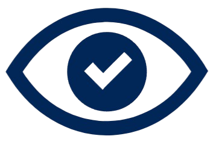
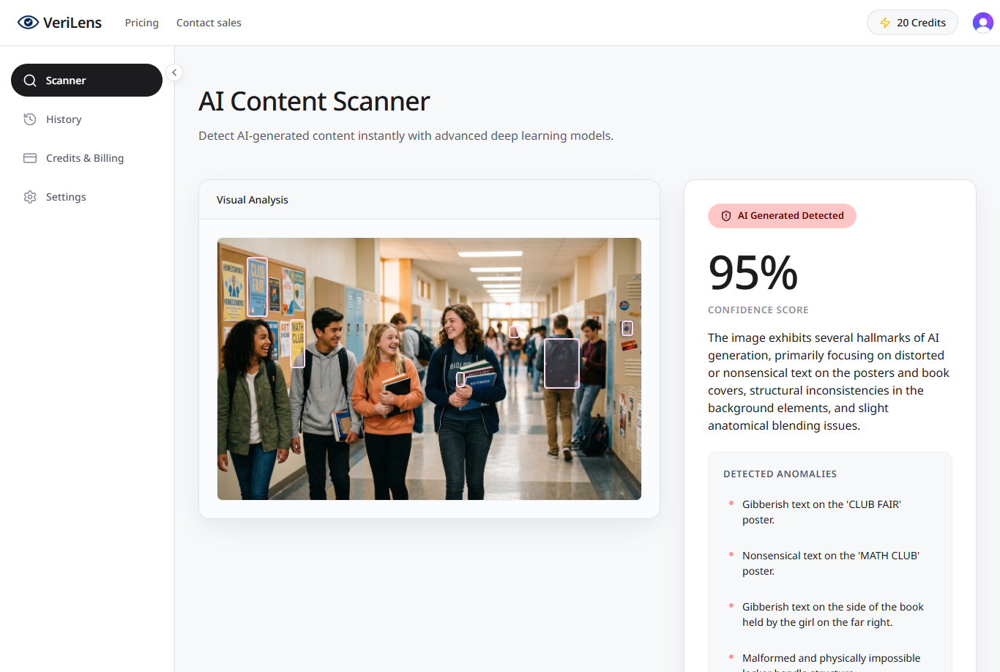
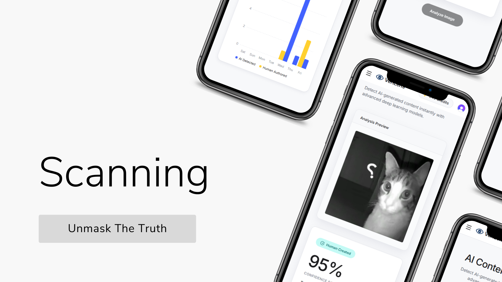
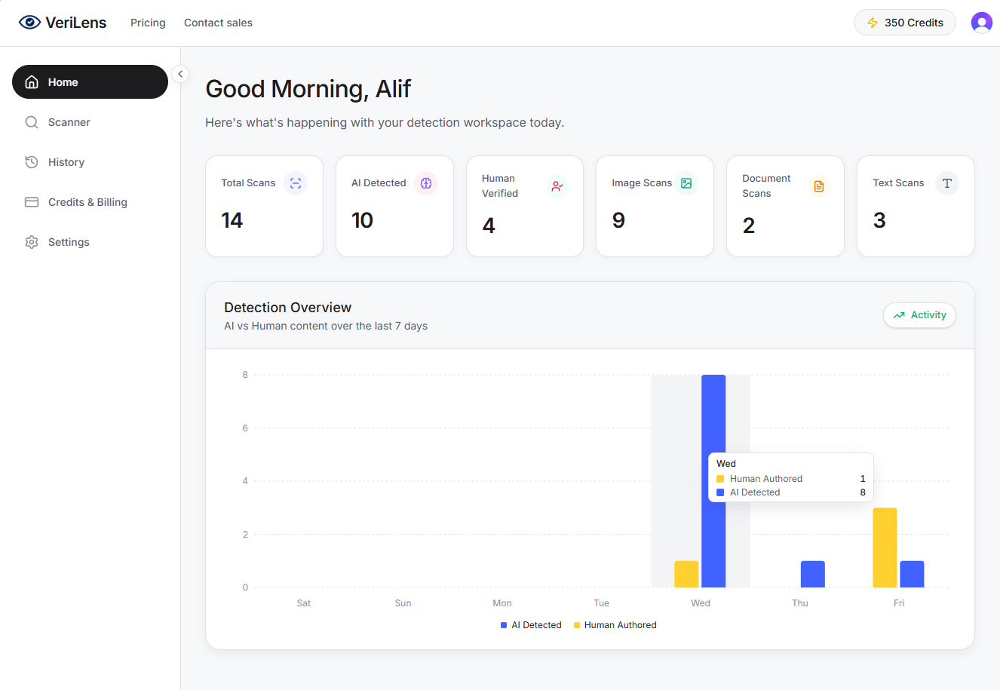
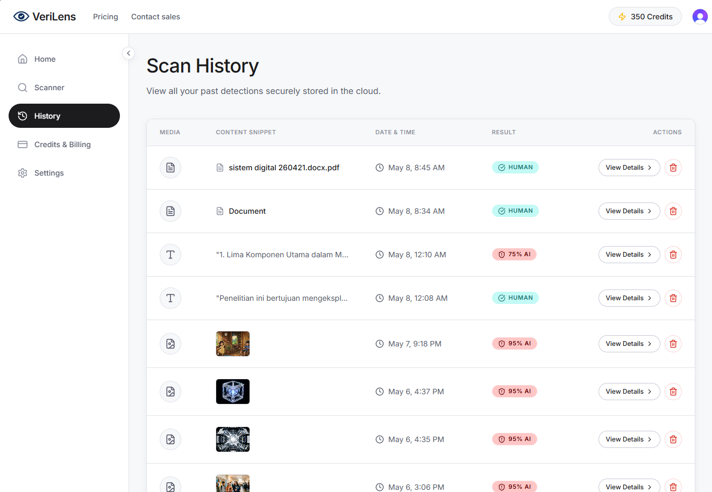

<div align="center">
  
  <h1>VeriLens AI</h1>
  <p><strong>The Future of Smarter Detection — Pixel-Level Forensic Analysis & Media Verification</strong></p>

  <p>
    <a href="#features">Features</a> •
    <a href="#preview-showcase">Preview Showcase</a> •
    <a href="#tech-stack">Tech Stack</a> •
    <a href="#system-architecture">Architecture</a> •
    <a href="#installation--setup">Setup Guide</a>
  </p>

  <hr />
</div>

VeriLens AI is a state-of-the-art media verification platform built for digital truth. Powered by advanced ensemble AI models, it enables trust & safety teams, digital forensics experts, and newsrooms to instantly detect deepfakes, synthetic media, and AI-generated text or documents with high accuracy. 

The platform features a sleek, **Miro-inspired** design system that provides an interactive workspace featuring pixel-level highlights for visual anomalies, precise document text extraction, and comprehensive activity analytics.

---

## 🌟 Key Capabilities

### 🔍 Multi-Format Detection
- **Image Scanning**: Analyzes pixel blending errors, metadata anomalies, and forensic compression artifacts typical of generators like Midjourney, DALL-E 3, and Stable Diffusion.
- **Document Verification (PDF)**: Scans PDF files to check for AI-generated phrasing and structural repetitions, identifying sections that lack human perplexity.
- **Text Analysis**: Highlights robotic phrasing and robotic patterns directly on a visual interface, helping verify the origin of text snippets.

### 📍 Precise Forensic Highlighting
- **2D Bounding Boxes**: Automatically tags specific visual anomalies on scanned images using pixel coordinate bounding boxes.
- **Interactive Inline Marks**: Highlights synthetic sentences and phrasing in documents and text with hoverable tooltips explaining the anomaly.

### 📊 Workspace & Analytics
- **Live Performance Metrics**: Real-time stats counting total scans, AI-detected media, and human-verified media.
- **Weekly Trend Overviews**: Built-in interactive Recharts graph mapping AI vs. Human creation trends over the last 7 days.
- **Cloud-Based Scan History**: Easily review, filter, preview, and permanently delete past scans.
- **Credit Balance Management**: Credit-based usage dashboard (50 initial credits, 10 credits deducted per scan).
- **Localization**: Easily switch preferred output translation between **Indonesian** and **English** for AI forensic conclusions.

---

## 📸 Preview Showcase

### 🖥️ Main Workspace Mockup
The unified interactive dashboard where media can be scanned and verified:


### 🔬 Real-Time Content Scanner
Multi-tab workspace support for Image, Document, and Text analyses:


### 📈 Forensics Analytics
Visual trend charts detailing AI vs. Human verification history over a rolling 7-day period:


### 📜 Cloud History Records
Secure scan history log with quick detail previews and delete operations:


---

## 🛠️ Tech Stack & Key Technologies

### Frontend
- **Framework**: [Next.js 16 (App Router)](https://nextjs.org/)
- **Core Library**: [React 19](https://react.dev/)
- **Styling**: [Tailwind CSS 4](https://tailwindcss.com/)
- **Animations**: [Framer Motion 12](https://www.framer.com/motion/) & [Anime.js](https://animejs.com/)
- **Charts & Graphs**: [Recharts](https://recharts.org/)
- **UI Components**: [Base UI React](https://base-ui.com/), Radix UI primitives, Lucide Icons, and Sonner toasts

### Backend & Authentication
- **Database & Storage**: [Convex](https://www.convex.dev/) — real-time queries, mutations, and direct cloud media storage.
- **Authentication**: [Clerk](https://clerk.com/) — seamless user onboarding and credential management.
- **Webhook Syncing**: [Svix](https://www.svix.com/) — secure Clerk-to-Convex automated user synchronization.

### Artificial Intelligence
- **AI Model Orchestrator**: [OpenRouter](https://openrouter.ai/) API
- **Forensic Engine**: `google/gemini-3.1-pro-preview` — processes images, documents, and raw text payloads returning structured JSON diagnostics.

---

## 📁 Repository Tour

Here is a map of the primary codebase directory structure:

- 📂 [**`app/`**](file:///d:/Code/FullStack/Ai%20Detector/ai-lens/app): Next.js App Router root layout and routes.
  - 📄 [`layout.tsx`](file:///d:/Code/FullStack/Ai%20Detector/ai-lens/app/layout.tsx): Wraps the entire application with Clerk, Convex, and Theme providers.
  - 📄 [`page.tsx`](file:///d:/Code/FullStack/Ai%20Detector/ai-lens/app/page.tsx): Premium interactive landing page with video background (`public/Background.mp4`).
  - 📂 [**`(workspace)/`**](file:///d:/Code/FullStack/Ai%20Detector/ai-lens/app/(workspace)): Logged-in dashboard screens.
    - 📂 [`home/page.tsx`](file:///d:/Code/FullStack/Ai%20Detector/ai-lens/app/(workspace)/home/page.tsx): Recharts-powered analytics page showing stats & weekly activity.
    - 📂 [`scanner/page.tsx`](file:///d:/Code/FullStack/Ai%20Detector/ai-lens/app/(workspace)/scanner/page.tsx): Core scanning interface supporting Drag & Drop file uploads.
    - 📂 [`history/page.tsx`](file:///d:/Code/FullStack/Ai%20Detector/ai-lens/app/(workspace)/history/page.tsx): Detailed scans log and modal preview window.
    - 📂 [`credits/page.tsx`](file:///d:/Code/FullStack/Ai%20Detector/ai-lens/app/(workspace)/credits/page.tsx): Subscription details and user balance cards.
    - 📂 [`settings/page.tsx`](file:///d:/Code/FullStack/Ai%20Detector/ai-lens/app/(workspace)/settings/page.tsx): Language output preferences (English vs. Indonesian).
  - 📂 [**`api/`**](file:///d:/Code/FullStack/Ai%20Detector/ai-lens/app/api): Next.js Route Handlers.
    - 📂 [`detect/route.ts`](file:///d:/Code/FullStack/Ai%20Detector/ai-lens/app/api/detect/route.ts): Connects OpenRouter to execute the Gemini digital forensic prompt.
    - 📂 [`webhooks/clerk/route.ts`](file:///d:/Code/FullStack/Ai%20Detector/ai-lens/app/api/webhooks/clerk/route.ts): Clerk Svix webhook receiver synchronizing new accounts.
- 📂 [**`convex/`**](file:///d:/Code/FullStack/Ai%20Detector/ai-lens/convex): Convex Backend schemas and database endpoints.
  - 📄 [`schema.ts`](file:///d:/Code/FullStack/Ai%20Detector/ai-lens/convex/schema.ts): Schemas for the `users` and `scans` tables.
  - 📄 [`users.ts`](file:///d:/Code/FullStack/Ai%20Detector/ai-lens/convex/users.ts): Mutations to initialize user profile, manage language settings, and handle credits.
  - 📄 [`scans.ts`](file:///d:/Code/FullStack/Ai%20Detector/ai-lens/convex/scans.ts): Logic for retrieving, saving, and deleting forensic scan history.
- 📂 [**`components/`**](file:///d:/Code/FullStack/Ai%20Detector/ai-lens/components): Modular dashboard widgets, layout sidebars, and theme providers.
- 📂 [**`public/`**](file:///d:/Code/FullStack/Ai%20Detector/ai-lens/public): Static assets (images, video background, app logos).

---

## 🚀 Installation & Setup

Follow these steps to run VeriLens AI locally:

### 1. Clone the repository and install dependencies
```bash
git clone https://github.com/<your-username>/ai-lens.git
cd ai-lens
npm install
```

### 2. Configure Environment Variables
Create a `.env.local` file in the root directory and add the following:
```env
# Clerk Authentication Configuration
NEXT_PUBLIC_CLERK_PUBLISHABLE_KEY=your_clerk_publishable_key
CLERK_SECRET_KEY=your_clerk_secret_key
NEXT_PUBLIC_CLERK_SIGN_IN_URL=/sign-in
NEXT_PUBLIC_CLERK_SIGN_UP_URL=/sign-up
NEXT_PUBLIC_CLERK_SIGN_IN_FALLBACK_REDIRECT_URL=/scanner
NEXT_PUBLIC_CLERK_SIGN_UP_FALLBACK_REDIRECT_URL=/scanner
CLERK_FRONTEND_API_URL=https://your-clerk-api.clerk.accounts.dev
CLERK_WEBHOOK_SECRET=whsec_your_clerk_webhook_secret

# OpenRouter API Key for Gemini Forensics Engine
OPENROUTER_API_KEY=your_openrouter_api_key

# Convex Database Configuration
CONVEX_DEPLOYMENT=your_convex_deployment_id
NEXT_PUBLIC_CONVEX_URL=https://your-convex-deployment.convex.cloud
NEXT_PUBLIC_CONVEX_SITE_URL=https://your-convex-deployment.convex.site
```

### 3. Run the Database & Storage (Convex)
In a separate terminal, start the Convex development environment:
```bash
npx convex dev
```
This automatically syncs your local schemas and functions to your Convex cloud project.

### 4. Run the Next.js Frontend
Start the local Next.js development server:
```bash
npm run dev
```
Open [http://localhost:3000](http://localhost:3000) with your browser to experience VeriLens AI!

---

## 🎨 Visual Identity & Theme
VeriLens AI uses a unique visual design inspired by **Miro**. Key aesthetics include:
* **Brand Highlights**: Canary Yellow (`#ffd02f`) accentuating badges, credit cards, and focus states.
* **Dominant Interactive Elements**: Dark pill-shaped buttons (`#1c1c1e`, rounded full).
* **Atmospheric Colors**: Pastel variations of rose, coral, and teal to distinguish different scan outputs and categories.
* **Real UI Mockups**: Avoids stock imagery, relying on genuine interface representations for visual context.

---
